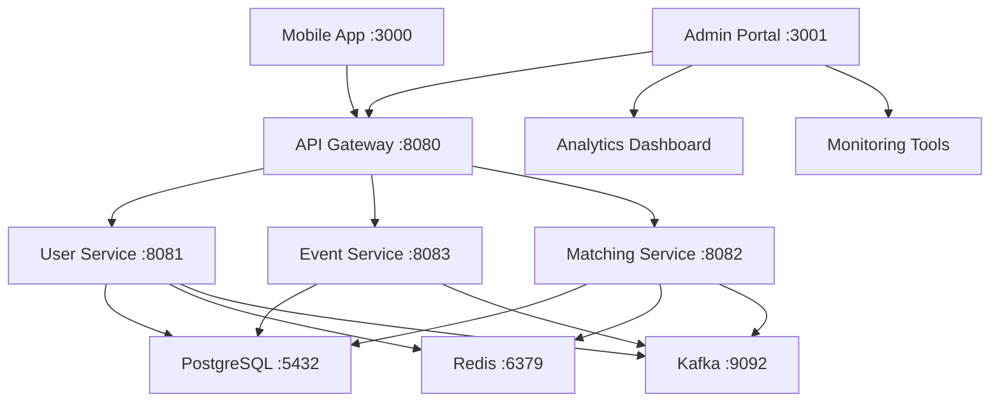

# Meetinity Admin Portal - API Integration Guide

## Overview

The **Meetinity Admin Portal** is a React-based administrative interface for managing the Meetinity professional networking platform. This portal provides comprehensive tools for user management, event oversight, matching analytics, and system monitoring.

## Architecture Integration



## API Configuration

### Environment Variables
```env
# API Configuration
VITE_API_URL=http://localhost:8080
VITE_API_TIMEOUT=30000
VITE_API_RETRY_ATTEMPTS=3

# Authentication
VITE_JWT_STORAGE_KEY=meetinity_admin_token
VITE_REFRESH_TOKEN_KEY=meetinity_admin_refresh_token
VITE_TOKEN_REFRESH_THRESHOLD=300000  # 5 minutes before expiry

# Admin Configuration
VITE_ADMIN_ROLE_REQUIRED=admin
VITE_SUPER_ADMIN_ROLE=super_admin
VITE_MODERATOR_ROLE=moderator

# Feature Flags
VITE_ENABLE_USER_MANAGEMENT=true
VITE_ENABLE_EVENT_MANAGEMENT=true
VITE_ENABLE_MATCHING_ANALYTICS=true
VITE_ENABLE_SYSTEM_MONITORING=true
VITE_ENABLE_CONTENT_MODERATION=true

# Analytics Configuration
VITE_ANALYTICS_REFRESH_INTERVAL=30000  # 30 seconds
VITE_METRICS_RETENTION_DAYS=90
VITE_EXPORT_MAX_RECORDS=10000

# App Configuration
VITE_APP_NAME=Meetinity Admin Portal
VITE_APP_VERSION=1.0.0
VITE_SUPPORT_EMAIL=admin@meetinity.com
```

### Admin API Client Configuration
```typescript
// src/config/adminApi.ts
export const ADMIN_API_CONFIG = {
  baseURL: import.meta.env.VITE_API_URL || 'http://localhost:8080',
  timeout: parseInt(import.meta.env.VITE_API_TIMEOUT) || 30000,
  retryAttempts: parseInt(import.meta.env.VITE_API_RETRY_ATTEMPTS) || 3,
  retryDelay: 1000,
  headers: {
    'Content-Type': 'application/json',
    'Accept': 'application/json',
    'X-Client-Version': import.meta.env.VITE_APP_VERSION || '1.0.0',
    'X-Client-Platform': 'admin-web',
    'X-Admin-Portal': 'true'
  }
};

// Enhanced API Client for Admin Operations
import axios, { AxiosInstance, AxiosRequestConfig } from 'axios';

class AdminApiClient {
  private client: AxiosInstance;
  private refreshPromise: Promise<string> | null = null;

  constructor() {
    this.client = axios.create(ADMIN_API_CONFIG);
    this.setupInterceptors();
  }

  private setupInterceptors() {
    // Request interceptor for admin auth
    this.client.interceptors.request.use(
      (config) => {
        const token = this.getStoredToken();
        if (token) {
          config.headers.Authorization = `Bearer ${token}`;
        }
        
        // Add admin context headers
        config.headers['X-Admin-Request'] = 'true';
        config.headers['X-Request-ID'] = this.generateRequestId();
        
        return config;
      },
      (error) => Promise.reject(error)
    );

    // Response interceptor with admin-specific error handling
    this.client.interceptors.response.use(
      (response) => {
        // Log admin actions for audit trail
        this.logAdminAction(response.config);
        return response;
      },
      async (error) => {
        const originalRequest = error.config;
        
        if (error.response?.status === 401 && !originalRequest._retry) {
          originalRequest._retry = true;
          
          try {
            const newToken = await this.refreshToken();
            originalRequest.headers.Authorization = `Bearer ${newToken}`;
            return this.client(originalRequest);
          } catch (refreshError) {
            this.handleAuthError();
            return Promise.reject(refreshError);
          }
        }
        
        // Handle admin-specific errors
        if (error.response?.status === 403) {
          this.handlePermissionError(error.response.data);
        }
        
        return Promise.reject(error);
      }
    );
  }

  private generateRequestId(): string {
    return `admin-${Date.now()}-${Math.random().toString(36).substr(2, 9)}`;
  }

  private logAdminAction(config: any) {
    if (config.method !== 'get') {
      console.log(`Admin Action: ${config.method?.toUpperCase()} ${config.url}`, {
        timestamp: new Date().toISOString(),
        admin: this.getCurrentAdmin(),
        requestId: config.headers['X-Request-ID']
      });
    }
  }

  private getCurrentAdmin() {
    try {
      const token = this.getStoredToken();
      if (token) {
        const payload = JSON.parse(atob(token.split('.')[1]));
        return {
          id: payload.user_id,
          email: payload.email,
          role: payload.role
        };
      }
    } catch (error) {
      console.error('Failed to parse admin token:', error);
    }
    return null;
  }

  private handlePermissionError(errorData: any) {
    console.error('Admin permission denied:', errorData);
    // Could show a permission denied modal or redirect
  }

  private async refreshToken(): Promise<string> {
    if (this.refreshPromise) {
      return this.refreshPromise;
    }

    this.refreshPromise = this.performTokenRefresh();
    
    try {
      const token = await this.refreshPromise;
      return token;
    } finally {
      this.refreshPromise = null;
    }
  }

  private async performTokenRefresh(): Promise<string> {
    const refreshToken = localStorage.getItem(import.meta.env.VITE_REFRESH_TOKEN_KEY);
    
    if (!refreshToken) {
      throw new Error('No refresh token available');
    }

    const response = await axios.post(`${ADMIN_API_CONFIG.baseURL}/api/auth/refresh`, {
      refresh_token: refreshToken
    });

    const { access_token, refresh_token: newRefreshToken } = response.data;
    
    localStorage.setItem(import.meta.env.VITE_JWT_STORAGE_KEY, access_token);
    localStorage.setItem(import.meta.env.VITE_REFRESH_TOKEN_KEY, newRefreshToken);
    
    return access_token;
  }

  private getStoredToken(): string | null {
    return localStorage.getItem(import.meta.env.VITE_JWT_STORAGE_KEY);
  }

  private handleAuthError() {
    localStorage.removeItem(import.meta.env.VITE_JWT_STORAGE_KEY);
    localStorage.removeItem(import.meta.env.VITE_REFRESH_TOKEN_KEY);
    window.location.href = '/admin/login';
  }

  // Public API methods with admin context
  async get<T>(url: string, config?: AxiosRequestConfig): Promise<T> {
    const response = await this.client.get<T>(url, config);
    return response.data;
  }

  async post<T>(url: string, data?: any, config?: AxiosRequestConfig): Promise<T> {
    const response = await this.client.post<T>(url, data, config);
    return response.data;
  }

  async put<T>(url: string, data?: any, config?: AxiosRequestConfig): Promise<T> {
    const response = await this.client.put<T>(url, data, config);
    return response.data;
  }

  async delete<T>(url: string, config?: AxiosRequestConfig): Promise<T> {
    const response = await this.client.delete<T>(url, config);
    return response.data;
  }

  async patch<T>(url: string, data?: any, config?: AxiosRequestConfig): Promise<T> {
    const response = await this.client.patch<T>(url, data, config);
    return response.data;
  }
}

export const adminApiClient = new AdminApiClient();
```

## Admin API Endpoints

### User Management API
```typescript
// src/services/adminUserService.ts
export interface AdminUserProfile {
  id: string;
  email: string;
  name: string;
  profile_picture_url?: string;
  bio?: string;
  location?: string;
  industry?: string;
  job_title?: string;
  company?: string;
  is_active: boolean;
  is_verified: boolean;
  is_banned: boolean;
  ban_reason?: string;
  last_login?: string;
  created_at: string;
  updated_at: string;
  stats: {
    events_created: number;
    events_attended: number;
    matches_made: number;
    profile_completeness: number;
  };
}

export interface UserFilters {
  search?: string;
  is_active?: boolean;
  is_verified?: boolean;
  is_banned?: boolean;
  industry?: string;
  location?: string;
  created_from?: string;
  created_to?: string;
  last_login_from?: string;
  last_login_to?: string;
}

export interface UsersResponse {
  users: AdminUserProfile[];
  total: number;
  page: number;
  limit: number;
  has_next: boolean;
  has_prev: boolean;
  filters_applied: UserFilters;
}

export interface UserActionRequest {
  user_id: string;
  action: 'activate' | 'deactivate' | 'ban' | 'unban' | 'verify' | 'unverify';
  reason?: string;
  duration?: number; // For temporary bans (in days)
}

export interface BulkUserActionRequest {
  user_ids: string[];
  action: 'activate' | 'deactivate' | 'ban' | 'verify' | 'export';
  reason?: string;
}

export class AdminUserService {
  async getUsers(page = 1, limit = 20, filters?: UserFilters): Promise<UsersResponse> {
    const params = new URLSearchParams({
      page: page.toString(),
      limit: limit.toString(),
      ...filters
    });
    
    return adminApiClient.get<UsersResponse>(`/api/admin/users?${params.toString()}`);
  }

  async getUser(userId: string): Promise<AdminUserProfile> {
    return adminApiClient.get<AdminUserProfile>(`/api/admin/users/${userId}`);
  }

  async updateUser(userId: string, updates: Partial<AdminUserProfile>): Promise<AdminUserProfile> {
    return adminApiClient.put<AdminUserProfile>(`/api/admin/users/${userId}`, updates);
  }

  async performUserAction(actionRequest: UserActionRequest): Promise<{ success: boolean; message: string }> {
    return adminApiClient.post<{ success: boolean; message: string }>('/api/admin/users/action', actionRequest);
  }

  async performBulkAction(bulkRequest: BulkUserActionRequest): Promise<{ 
    success: boolean; 
    processed: number; 
    failed: number; 
    errors: string[] 
  }> {
    return adminApiClient.post('/api/admin/users/bulk-action', bulkRequest);
  }

  async getUserActivity(userId: string, days = 30): Promise<{
    login_history: Array<{ date: string; count: number }>;
    event_activity: Array<{ date: string; created: number; attended: number }>;
    matching_activity: Array<{ date: string; swipes: number; matches: number }>;
  }> {
    return adminApiClient.get(`/api/admin/users/${userId}/activity?days=${days}`);
  }

  async exportUsers(filters?: UserFilters): Promise<{ download_url: string; expires_at: string }> {
    return adminApiClient.post('/api/admin/users/export', { filters });
  }

  async getUserReports(userId: string): Promise<{
    reports: Array<{
      id: string;
      reported_by: string;
      reason: string;
      details?: string;
      status: 'pending' | 'reviewed' | 'resolved';
      created_at: string;
    }>;
  }> {
    return adminApiClient.get(`/api/admin/users/${userId}/reports`);
  }

  async searchUsers(query: string, limit = 10): Promise<{ users: AdminUserProfile[] }> {
    return adminApiClient.get(`/api/admin/users/search?q=${encodeURIComponent(query)}&limit=${limit}`);
  }
}

export const adminUserService = new AdminUserService();
```

### Event Management API
```typescript
// src/services/adminEventService.ts
export interface AdminEvent {
  id: string;
  title: string;
  description?: string;
  location?: string;
  start_date: string;
  end_date?: string;
  max_attendees?: number;
  current_attendees: number;
  category: string;
  tags: string[];
  status: 'active' | 'cancelled' | 'completed' | 'under_review';
  created_by: string;
  created_by_name: string;
  created_at: string;
  updated_at: string;
  moderation: {
    is_flagged: boolean;
    flag_reason?: string;
    reviewed_by?: string;
    reviewed_at?: string;
  };
  stats: {
    views: number;
    registrations: number;
    cancellations: number;
    attendance_rate: number;
  };
}

export interface EventFilters {
  search?: string;
  category?: string;
  status?: string;
  is_flagged?: boolean;
  created_from?: string;
  created_to?: string;
  start_date_from?: string;
  start_date_to?: string;
  location?: string;
  created_by?: string;
}

export interface EventsResponse {
  events: AdminEvent[];
  total: number;
  page: number;
  limit: number;
  has_next: boolean;
  has_prev: boolean;
  filters_applied: EventFilters;
}

export interface EventModerationRequest {
  event_id: string;
  action: 'approve' | 'reject' | 'flag' | 'unflag';
  reason?: string;
  notify_creator?: boolean;
}

export class AdminEventService {
  async getEvents(page = 1, limit = 20, filters?: EventFilters): Promise<EventsResponse> {
    const params = new URLSearchParams({
      page: page.toString(),
      limit: limit.toString(),
      ...filters
    });
    
    return adminApiClient.get<EventsResponse>(`/api/admin/events?${params.toString()}`);
  }

  async getEvent(eventId: string): Promise<AdminEvent> {
    return adminApiClient.get<AdminEvent>(`/api/admin/events/${eventId}`);
  }

  async updateEvent(eventId: string, updates: Partial<AdminEvent>): Promise<AdminEvent> {
    return adminApiClient.put<AdminEvent>(`/api/admin/events/${eventId}`, updates);
  }

  async moderateEvent(moderationRequest: EventModerationRequest): Promise<{ success: boolean; message: string }> {
    return adminApiClient.post('/api/admin/events/moderate', moderationRequest);
  }

  async getEventAttendees(eventId: string): Promise<{
    attendees: Array<{
      user_id: string;
      name: string;
      email: string;
      registration_status: string;
      registered_at: string;
    }>;
  }> {
    return adminApiClient.get(`/api/admin/events/${eventId}/attendees`);
  }

  async getFlaggedEvents(): Promise<{ events: AdminEvent[] }> {
    return adminApiClient.get('/api/admin/events/flagged');
  }

  async getEventAnalytics(eventId: string): Promise<{
    views_over_time: Array<{ date: string; views: number }>;
    registrations_over_time: Array<{ date: string; registrations: number }>;
    demographics: {
      by_industry: Record<string, number>;
      by_location: Record<string, number>;
      by_age_group: Record<string, number>;
    };
  }> {
    return adminApiClient.get(`/api/admin/events/${eventId}/analytics`);
  }

  async exportEvents(filters?: EventFilters): Promise<{ download_url: string; expires_at: string }> {
    return adminApiClient.post('/api/admin/events/export', { filters });
  }

  async deleteEvent(eventId: string, reason: string): Promise<{ success: boolean; message: string }> {
    return adminApiClient.delete(`/api/admin/events/${eventId}`, {
      data: { reason }
    });
  }
}

export const adminEventService = new AdminEventService();
```

### Matching Analytics API
```typescript
// src/services/adminMatchingService.ts
export interface MatchingMetrics {
  total_matches: number;
  mutual_matches: number;
  match_success_rate: number;
  average_compatibility_score: number;
  daily_swipes: number;
  daily_matches: number;
  top_matching_factors: Array<{
    factor: string;
    weight: number;
    success_rate: number;
  }>;
}

export interface MatchingAnalytics {
  matches_over_time: Array<{ date: string; matches: number; mutual_matches: number }>;
  swipes_over_time: Array<{ date: string; likes: number; passes: number }>;
  compatibility_distribution: Array<{ score_range: string; count: number }>;
  success_by_industry: Array<{ industry: string; success_rate: number; total_matches: number }>;
  success_by_location: Array<{ location: string; success_rate: number; total_matches: number }>;
  algorithm_performance: {
    current_version: string;
    accuracy: number;
    precision: number;
    recall: number;
    f1_score: number;
  };
}

export interface UserMatchingProfile {
  user_id: string;
  name: string;
  email: string;
  total_swipes: number;
  total_matches: number;
  mutual_matches: number;
  success_rate: number;
  average_compatibility: number;
  preferred_industries: string[];
  preferred_locations: string[];
  last_active: string;
}

export class AdminMatchingService {
  async getMatchingMetrics(period = '30d'): Promise<MatchingMetrics> {
    return adminApiClient.get<MatchingMetrics>(`/api/admin/matching/metrics?period=${period}`);
  }

  async getMatchingAnalytics(period = '30d'): Promise<MatchingAnalytics> {
    return adminApiClient.get<MatchingAnalytics>(`/api/admin/matching/analytics?period=${period}`);
  }

  async getUserMatchingProfiles(page = 1, limit = 20, sortBy = 'success_rate'): Promise<{
    profiles: UserMatchingProfile[];
    total: number;
    page: number;
    limit: number;
  }> {
    const params = new URLSearchParams({
      page: page.toString(),
      limit: limit.toString(),
      sort_by: sortBy
    });
    
    return adminApiClient.get(`/api/admin/matching/user-profiles?${params.toString()}`);
  }

  async getUserMatchingDetails(userId: string): Promise<{
    profile: UserMatchingProfile;
    recent_matches: Array<{
      match_id: string;
      other_user_name: string;
      compatibility_score: number;
      status: string;
      matched_at: string;
    }>;
    swipe_patterns: {
      like_rate: number;
      pass_rate: number;
      super_like_rate: number;
      response_rate: number;
    };
  }> {
    return adminApiClient.get(`/api/admin/matching/users/${userId}/details`);
  }

  async getAlgorithmPerformance(): Promise<{
    current_model: {
      version: string;
      accuracy: number;
      precision: number;
      recall: number;
      f1_score: number;
      last_trained: string;
    };
    feature_importance: Array<{
      feature: string;
      importance: number;
      description: string;
    }>;
    performance_history: Array<{
      version: string;
      accuracy: number;
      deployed_at: string;
    }>;
  }> {
    return adminApiClient.get('/api/admin/matching/algorithm/performance');
  }

  async updateAlgorithmWeights(weights: Record<string, number>): Promise<{ success: boolean; message: string }> {
    return adminApiClient.put('/api/admin/matching/algorithm/weights', { weights });
  }

  async exportMatchingData(filters?: {
    date_from?: string;
    date_to?: string;
    include_user_data?: boolean;
  }): Promise<{ download_url: string; expires_at: string }> {
    return adminApiClient.post('/api/admin/matching/export', { filters });
  }

  async getMatchingReports(): Promise<{
    reports: Array<{
      id: string;
      type: 'fake_profile' | 'inappropriate_behavior' | 'spam' | 'harassment';
      reported_user_id: string;
      reported_user_name: string;
      reporter_id: string;
      details: string;
      status: 'pending' | 'investigating' | 'resolved' | 'dismissed';
      created_at: string;
    }>;
  }> {
    return adminApiClient.get('/api/admin/matching/reports');
  }

  async resolveMatchingReport(reportId: string, resolution: {
    action: 'dismiss' | 'warn_user' | 'suspend_user' | 'ban_user';
    reason: string;
    duration?: number; // For suspensions
  }): Promise<{ success: boolean; message: string }> {
    return adminApiClient.post(`/api/admin/matching/reports/${reportId}/resolve`, resolution);
  }
}

export const adminMatchingService = new AdminMatchingService();
```

### System Monitoring API
```typescript
// src/services/adminSystemService.ts
export interface SystemHealth {
  overall_status: 'healthy' | 'degraded' | 'critical';
  services: {
    api_gateway: { status: 'up' | 'down'; response_time: number; last_check: string };
    user_service: { status: 'up' | 'down'; response_time: number; last_check: string };
    event_service: { status: 'up' | 'down'; response_time: number; last_check: string };
    matching_service: { status: 'up' | 'down'; response_time: number; last_check: string };
    database: { status: 'up' | 'down'; connections: number; last_check: string };
    redis: { status: 'up' | 'down'; memory_usage: number; last_check: string };
    kafka: { status: 'up' | 'down'; topics: number; last_check: string };
  };
  performance: {
    avg_response_time: number;
    error_rate: number;
    throughput: number;
    active_users: number;
  };
}

export interface SystemMetrics {
  api_metrics: {
    requests_per_minute: Array<{ timestamp: string; count: number }>;
    error_rates: Array<{ timestamp: string; rate: number }>;
    response_times: Array<{ timestamp: string; avg_time: number; p95_time: number }>;
    top_endpoints: Array<{ endpoint: string; requests: number; avg_time: number }>;
  };
  user_metrics: {
    active_users: Array<{ timestamp: string; count: number }>;
    new_registrations: Array<{ timestamp: string; count: number }>;
    user_retention: Array<{ period: string; retention_rate: number }>;
  };
  business_metrics: {
    events_created: Array<{ timestamp: string; count: number }>;
    matches_made: Array<{ timestamp: string; count: number }>;
    engagement_rate: Array<{ timestamp: string; rate: number }>;
  };
}

export interface AuditLog {
  id: string;
  admin_id: string;
  admin_email: string;
  action: string;
  resource_type: 'user' | 'event' | 'system' | 'matching';
  resource_id?: string;
  details: Record<string, any>;
  ip_address: string;
  user_agent: string;
  timestamp: string;
}

export class AdminSystemService {
  async getSystemHealth(): Promise<SystemHealth> {
    return adminApiClient.get<SystemHealth>('/api/admin/system/health');
  }

  async getSystemMetrics(period = '24h'): Promise<SystemMetrics> {
    return adminApiClient.get<SystemMetrics>(`/api/admin/system/metrics?period=${period}`);
  }

  async getAuditLogs(page = 1, limit = 50, filters?: {
    admin_id?: string;
    action?: string;
    resource_type?: string;
    date_from?: string;
    date_to?: string;
  }): Promise<{
    logs: AuditLog[];
    total: number;
    page: number;
    limit: number;
  }> {
    const params = new URLSearchParams({
      page: page.toString(),
      limit: limit.toString(),
      ...filters
    });
    
    return adminApiClient.get(`/api/admin/system/audit-logs?${params.toString()}`);
  }

  async getErrorLogs(page = 1, limit = 50, severity?: 'error' | 'warning' | 'critical'): Promise<{
    logs: Array<{
      id: string;
      level: string;
      message: string;
      service: string;
      timestamp: string;
      stack_trace?: string;
      context: Record<string, any>;
    }>;
    total: number;
  }> {
    const params = new URLSearchParams({
      page: page.toString(),
      limit: limit.toString(),
      ...(severity && { severity })
    });
    
    return adminApiClient.get(`/api/admin/system/error-logs?${params.toString()}`);
  }

  async getSystemConfiguration(): Promise<{
    features: Record<string, boolean>;
    limits: Record<string, number>;
    settings: Record<string, any>;
  }> {
    return adminApiClient.get('/api/admin/system/configuration');
  }

  async updateSystemConfiguration(updates: {
    features?: Record<string, boolean>;
    limits?: Record<string, number>;
    settings?: Record<string, any>;
  }): Promise<{ success: boolean; message: string }> {
    return adminApiClient.put('/api/admin/system/configuration', updates);
  }

  async performSystemAction(action: {
    type: 'restart_service' | 'clear_cache' | 'run_maintenance' | 'backup_database';
    service?: string;
    parameters?: Record<string, any>;
  }): Promise<{ success: boolean; message: string; job_id?: string }> {
    return adminApiClient.post('/api/admin/system/actions', action);
  }

  async getJobStatus(jobId: string): Promise<{
    id: string;
    status: 'pending' | 'running' | 'completed' | 'failed';
    progress: number;
    message?: string;
    started_at: string;
    completed_at?: string;
  }> {
    return adminApiClient.get(`/api/admin/system/jobs/${jobId}`);
  }

  async exportSystemData(dataType: 'audit_logs' | 'error_logs' | 'metrics', filters?: Record<string, any>): Promise<{
    download_url: string;
    expires_at: string;
  }> {
    return adminApiClient.post('/api/admin/system/export', { data_type: dataType, filters });
  }
}

export const adminSystemService = new AdminSystemService();
```

## Dashboard Components Integration

### Real-time Dashboard
```typescript
// src/components/Dashboard/RealTimeDashboard.tsx
import React, { useState, useEffect } from 'react';
import { adminSystemService, adminUserService, adminEventService, adminMatchingService } from '../../services';

interface DashboardMetrics {
  users: {
    total: number;
    active_today: number;
    new_today: number;
    growth_rate: number;
  };
  events: {
    total: number;
    active: number;
    created_today: number;
    attendance_rate: number;
  };
  matching: {
    matches_today: number;
    success_rate: number;
    active_swipes: number;
  };
  system: {
    health_status: string;
    response_time: number;
    error_rate: number;
  };
}

export const RealTimeDashboard: React.FC = () => {
  const [metrics, setMetrics] = useState<DashboardMetrics | null>(null);
  const [loading, setLoading] = useState(true);
  const [lastUpdated, setLastUpdated] = useState<Date>(new Date());

  useEffect(() => {
    const fetchMetrics = async () => {
      try {
        const [systemHealth, userMetrics, eventMetrics, matchingMetrics] = await Promise.all([
          adminSystemService.getSystemHealth(),
          adminUserService.getUsers(1, 1), // Just for totals
          adminEventService.getEvents(1, 1), // Just for totals
          adminMatchingService.getMatchingMetrics('1d')
        ]);

        setMetrics({
          users: {
            total: userMetrics.total,
            active_today: systemHealth.performance.active_users,
            new_today: 0, // Would come from a specific endpoint
            growth_rate: 0 // Would be calculated
          },
          events: {
            total: eventMetrics.total,
            active: eventMetrics.events.filter(e => e.status === 'active').length,
            created_today: 0, // Would come from a specific endpoint
            attendance_rate: 0.75 // Would be calculated
          },
          matching: {
            matches_today: matchingMetrics.daily_matches,
            success_rate: matchingMetrics.match_success_rate,
            active_swipes: matchingMetrics.daily_swipes
          },
          system: {
            health_status: systemHealth.overall_status,
            response_time: systemHealth.performance.avg_response_time,
            error_rate: systemHealth.performance.error_rate
          }
        });

        setLastUpdated(new Date());
      } catch (error) {
        console.error('Failed to fetch dashboard metrics:', error);
      } finally {
        setLoading(false);
      }
    };

    fetchMetrics();
    
    // Refresh every 30 seconds
    const interval = setInterval(fetchMetrics, 30000);
    
    return () => clearInterval(interval);
  }, []);

  if (loading || !metrics) {
    return <div>Loading dashboard...</div>;
  }

  return (
    <div className="dashboard-grid">
      <div className="metric-card">
        <h3>Users</h3>
        <div className="metric-value">{metrics.users.total.toLocaleString()}</div>
        <div className="metric-subtitle">
          {metrics.users.active_today} active today
        </div>
      </div>

      <div className="metric-card">
        <h3>Events</h3>
        <div className="metric-value">{metrics.events.total.toLocaleString()}</div>
        <div className="metric-subtitle">
          {metrics.events.active} currently active
        </div>
      </div>

      <div className="metric-card">
        <h3>Matching</h3>
        <div className="metric-value">{metrics.matching.matches_today}</div>
        <div className="metric-subtitle">
          {(metrics.matching.success_rate * 100).toFixed(1)}% success rate
        </div>
      </div>

      <div className="metric-card">
        <h3>System Health</h3>
        <div className={`metric-value status-${metrics.system.health_status}`}>
          {metrics.system.health_status.toUpperCase()}
        </div>
        <div className="metric-subtitle">
          {metrics.system.response_time}ms avg response
        </div>
      </div>

      <div className="last-updated">
        Last updated: {lastUpdated.toLocaleTimeString()}
      </div>
    </div>
  );
};
```

### User Management Table
```typescript
// src/components/Users/UserManagementTable.tsx
import React, { useState, useEffect } from 'react';
import { adminUserService, AdminUserProfile, UserFilters } from '../../services';

export const UserManagementTable: React.FC = () => {
  const [users, setUsers] = useState<AdminUserProfile[]>([]);
  const [loading, setLoading] = useState(true);
  const [filters, setFilters] = useState<UserFilters>({});
  const [selectedUsers, setSelectedUsers] = useState<string[]>([]);
  const [currentPage, setCurrentPage] = useState(1);
  const [totalPages, setTotalPages] = useState(1);

  useEffect(() => {
    fetchUsers();
  }, [currentPage, filters]);

  const fetchUsers = async () => {
    try {
      setLoading(true);
      const response = await adminUserService.getUsers(currentPage, 20, filters);
      setUsers(response.users);
      setTotalPages(Math.ceil(response.total / 20));
    } catch (error) {
      console.error('Failed to fetch users:', error);
    } finally {
      setLoading(false);
    }
  };

  const handleUserAction = async (userId: string, action: string, reason?: string) => {
    try {
      await adminUserService.performUserAction({
        user_id: userId,
        action: action as any,
        reason
      });
      
      // Refresh the user list
      fetchUsers();
    } catch (error) {
      console.error('Failed to perform user action:', error);
    }
  };

  const handleBulkAction = async (action: string) => {
    if (selectedUsers.length === 0) return;

    try {
      await adminUserService.performBulkAction({
        user_ids: selectedUsers,
        action: action as any,
        reason: `Bulk ${action} action`
      });
      
      setSelectedUsers([]);
      fetchUsers();
    } catch (error) {
      console.error('Failed to perform bulk action:', error);
    }
  };

  return (
    <div className="user-management-table">
      <div className="table-header">
        <div className="filters">
          <input
            type="text"
            placeholder="Search users..."
            value={filters.search || ''}
            onChange={(e) => setFilters({ ...filters, search: e.target.value })}
          />
          <select
            value={filters.is_active?.toString() || ''}
            onChange={(e) => setFilters({ 
              ...filters, 
              is_active: e.target.value ? e.target.value === 'true' : undefined 
            })}
          >
            <option value="">All Status</option>
            <option value="true">Active</option>
            <option value="false">Inactive</option>
          </select>
        </div>
        
        {selectedUsers.length > 0 && (
          <div className="bulk-actions">
            <button onClick={() => handleBulkAction('activate')}>
              Activate Selected
            </button>
            <button onClick={() => handleBulkAction('deactivate')}>
              Deactivate Selected
            </button>
            <button onClick={() => handleBulkAction('export')}>
              Export Selected
            </button>
          </div>
        )}
      </div>

      <table>
        <thead>
          <tr>
            <th>
              <input
                type="checkbox"
                checked={selectedUsers.length === users.length}
                onChange={(e) => {
                  if (e.target.checked) {
                    setSelectedUsers(users.map(u => u.id));
                  } else {
                    setSelectedUsers([]);
                  }
                }}
              />
            </th>
            <th>User</th>
            <th>Email</th>
            <th>Industry</th>
            <th>Status</th>
            <th>Last Login</th>
            <th>Actions</th>
          </tr>
        </thead>
        <tbody>
          {users.map((user) => (
            <tr key={user.id}>
              <td>
                <input
                  type="checkbox"
                  checked={selectedUsers.includes(user.id)}
                  onChange={(e) => {
                    if (e.target.checked) {
                      setSelectedUsers([...selectedUsers, user.id]);
                    } else {
                      setSelectedUsers(selectedUsers.filter(id => id !== user.id));
                    }
                  }}
                />
              </td>
              <td>
                <div className="user-info">
                  
                  <div>
                    <div className="name">{user.name}</div>
                    <div className="location">{user.location}</div>
                  </div>
                </div>
              </td>
              <td>{user.email}</td>
              <td>{user.industry}</td>
              <td>
                <span className={`status ${user.is_active ? 'active' : 'inactive'}`}>
                  {user.is_active ? 'Active' : 'Inactive'}
                </span>
                {user.is_banned && <span className="status banned">Banned</span>}
                {user.is_verified && <span className="status verified">Verified</span>}
              </td>
              <td>{user.last_login ? new Date(user.last_login).toLocaleDateString() : 'Never'}</td>
              <td>
                <div className="action-buttons">
                  <button onClick={() => handleUserAction(user.id, user.is_active ? 'deactivate' : 'activate')}>
                    {user.is_active ? 'Deactivate' : 'Activate'}
                  </button>
                  <button onClick={() => handleUserAction(user.id, user.is_banned ? 'unban' : 'ban')}>
                    {user.is_banned ? 'Unban' : 'Ban'}
                  </button>
                  <button onClick={() => window.open(`/admin/users/${user.id}`, '_blank')}>
                    View Details
                  </button>
                </div>
              </td>
            </tr>
          ))}
        </tbody>
      </table>

      <div className="pagination">
        <button 
          disabled={currentPage === 1}
          onClick={() => setCurrentPage(currentPage - 1)}
        >
          Previous
        </button>
        <span>Page {currentPage} of {totalPages}</span>
        <button 
          disabled={currentPage === totalPages}
          onClick={() => setCurrentPage(currentPage + 1)}
        >
          Next
        </button>
      </div>
    </div>
  );
};
```

## Security & Permissions

### Role-Based Access Control
```typescript
// src/utils/permissions.ts
export enum AdminRole {
  SUPER_ADMIN = 'super_admin',
  ADMIN = 'admin',
  MODERATOR = 'moderator',
  ANALYST = 'analyst'
}

export enum Permission {
  // User Management
  VIEW_USERS = 'view_users',
  EDIT_USERS = 'edit_users',
  BAN_USERS = 'ban_users',
  DELETE_USERS = 'delete_users',
  
  // Event Management
  VIEW_EVENTS = 'view_events',
  EDIT_EVENTS = 'edit_events',
  DELETE_EVENTS = 'delete_events',
  MODERATE_EVENTS = 'moderate_events',
  
  // System Management
  VIEW_SYSTEM_METRICS = 'view_system_metrics',
  MANAGE_SYSTEM_CONFIG = 'manage_system_config',
  PERFORM_SYSTEM_ACTIONS = 'perform_system_actions',
  
  // Analytics
  VIEW_ANALYTICS = 'view_analytics',
  EXPORT_DATA = 'export_data',
  
  // Matching
  VIEW_MATCHING_DATA = 'view_matching_data',
  MANAGE_ALGORITHM = 'manage_algorithm'
}

const ROLE_PERMISSIONS: Record<AdminRole, Permission[]> = {
  [AdminRole.SUPER_ADMIN]: Object.values(Permission),
  [AdminRole.ADMIN]: [
    Permission.VIEW_USERS,
    Permission.EDIT_USERS,
    Permission.BAN_USERS,
    Permission.VIEW_EVENTS,
    Permission.EDIT_EVENTS,
    Permission.MODERATE_EVENTS,
    Permission.VIEW_SYSTEM_METRICS,
    Permission.VIEW_ANALYTICS,
    Permission.EXPORT_DATA,
    Permission.VIEW_MATCHING_DATA
  ],
  [AdminRole.MODERATOR]: [
    Permission.VIEW_USERS,
    Permission.EDIT_USERS,
    Permission.VIEW_EVENTS,
    Permission.MODERATE_EVENTS,
    Permission.VIEW_ANALYTICS
  ],
  [AdminRole.ANALYST]: [
    Permission.VIEW_USERS,
    Permission.VIEW_EVENTS,
    Permission.VIEW_SYSTEM_METRICS,
    Permission.VIEW_ANALYTICS,
    Permission.EXPORT_DATA,
    Permission.VIEW_MATCHING_DATA
  ]
};

export class PermissionManager {
  private userRole: AdminRole | null = null;

  setUserRole(role: AdminRole) {
    this.userRole = role;
  }

  hasPermission(permission: Permission): boolean {
    if (!this.userRole) return false;
    return ROLE_PERMISSIONS[this.userRole].includes(permission);
  }

  hasAnyPermission(permissions: Permission[]): boolean {
    return permissions.some(permission => this.hasPermission(permission));
  }

  hasAllPermissions(permissions: Permission[]): boolean {
    return permissions.every(permission => this.hasPermission(permission));
  }

  getAvailablePermissions(): Permission[] {
    if (!this.userRole) return [];
    return ROLE_PERMISSIONS[this.userRole];
  }
}

export const permissionManager = new PermissionManager();

// React hook for permissions
export const usePermissions = () => {
  return {
    hasPermission: (permission: Permission) => permissionManager.hasPermission(permission),
    hasAnyPermission: (permissions: Permission[]) => permissionManager.hasAnyPermission(permissions),
    hasAllPermissions: (permissions: Permission[]) => permissionManager.hasAllPermissions(permissions)
  };
};
```

## Related Services Documentation

- **API Gateway**: [meetinity-api-gateway](https://github.com/decarvalhoe/meetinity-api-gateway)
- **User Service**: [meetinity-user-service](https://github.com/decarvalhoe/meetinity-user-service)
- **Event Service**: [meetinity-event-service](https://github.com/decarvalhoe/meetinity-event-service)
- **Matching Service**: [meetinity-matching-service](https://github.com/decarvalhoe/meetinity-matching-service)
- **Mobile App**: [meetinity-mobile-app](https://github.com/decarvalhoe/meetinity-mobile-app)
- **Main Repository**: [meetinity](https://github.com/decarvalhoe/meetinity)

---

**Status**: 60% Complete - Admin interface with user management  
**Last Updated**: September 2025  
**Maintainer**: decarvalhoe
